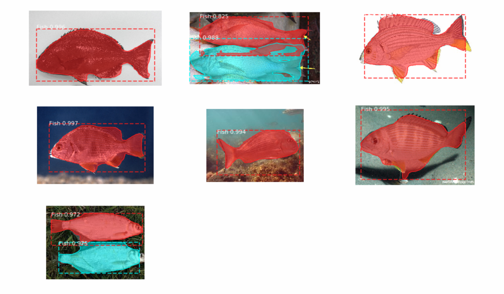
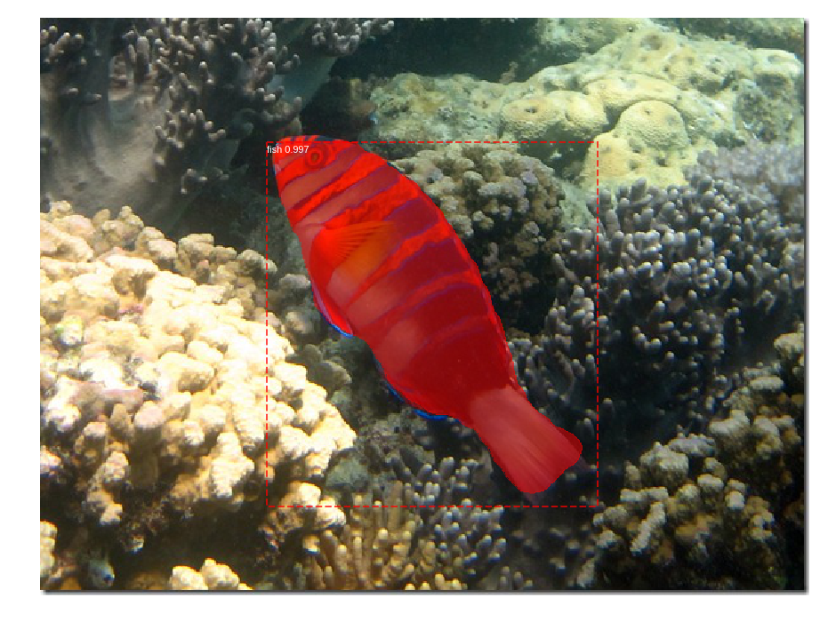
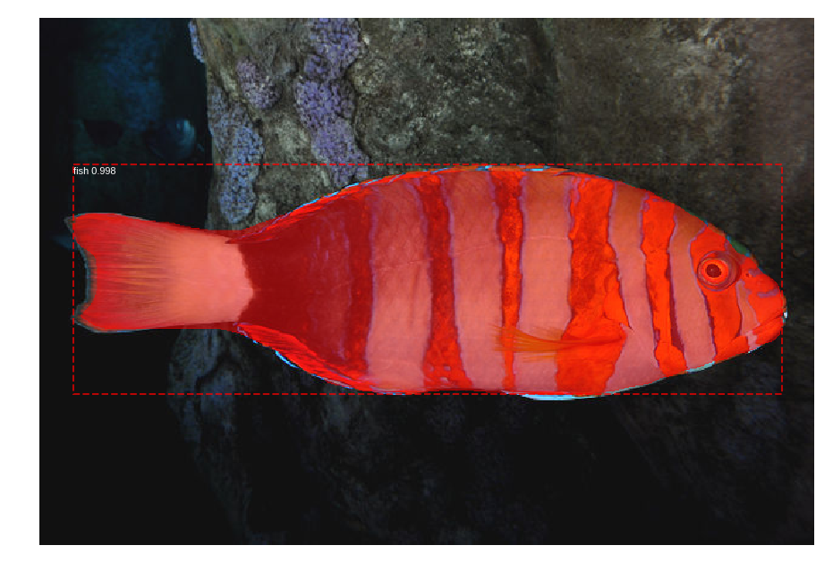
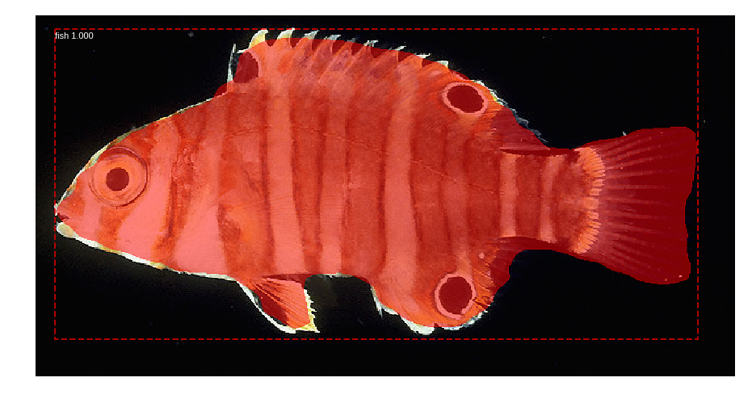
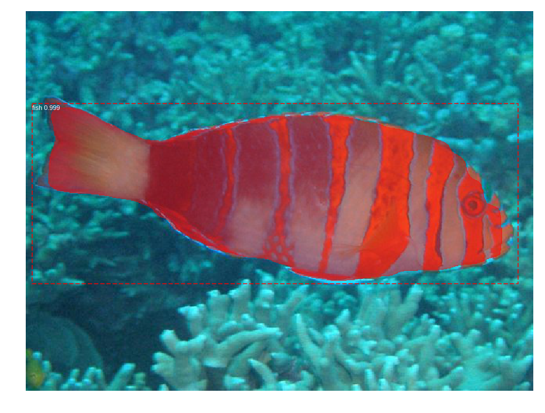
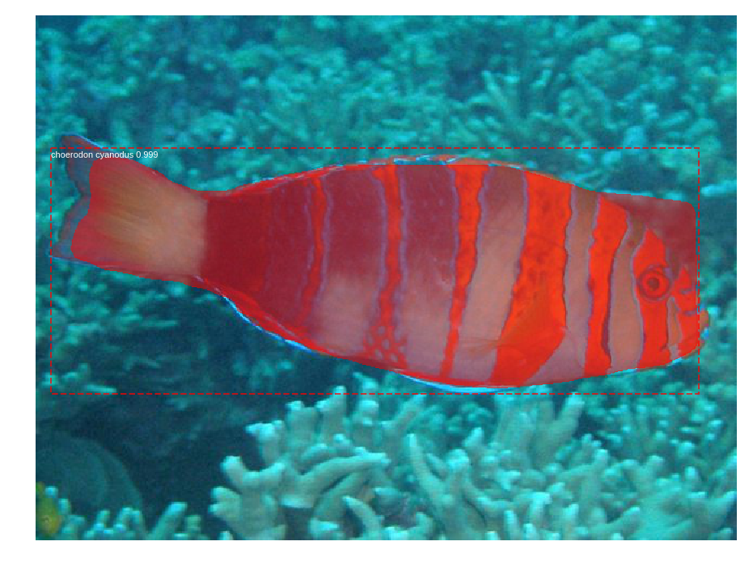
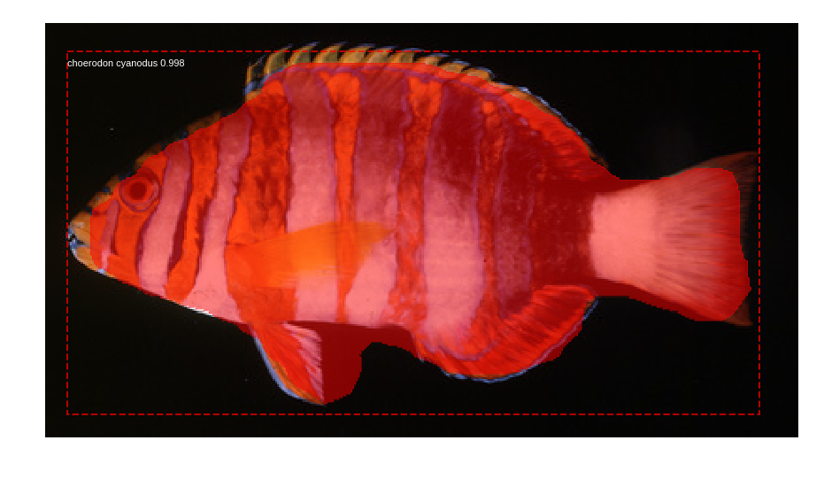
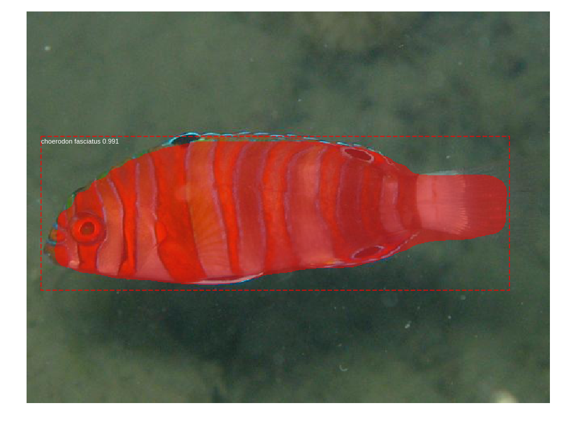
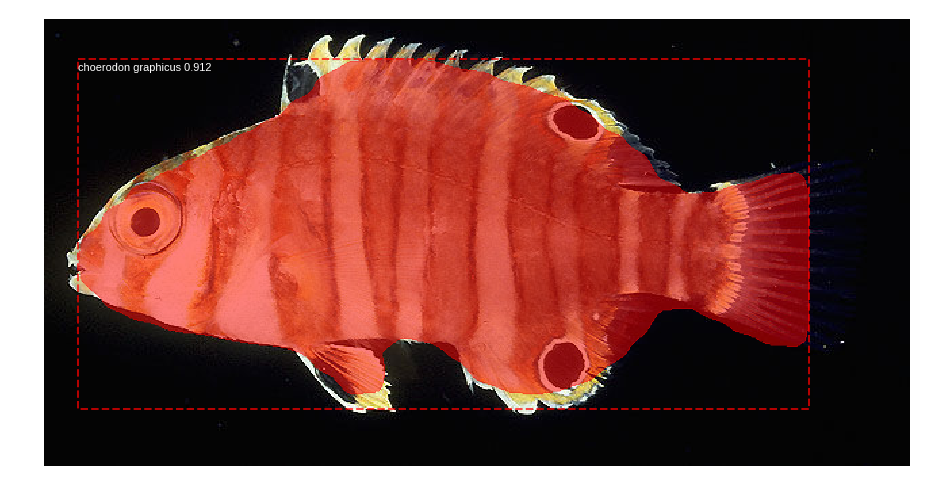
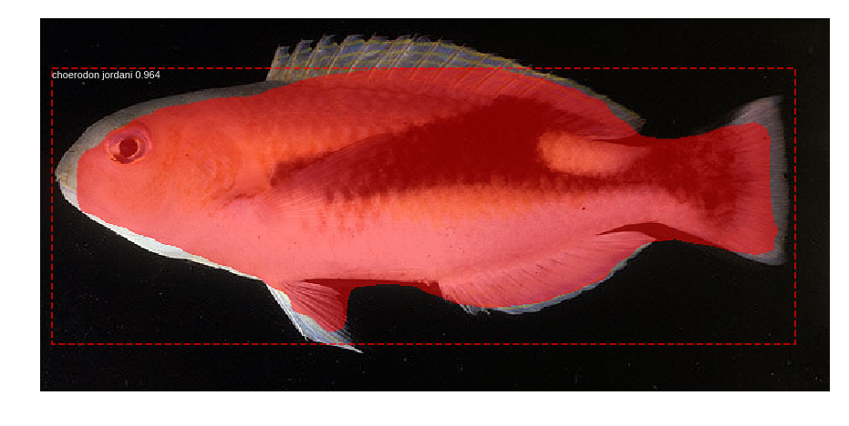

## Overview

This project is for Fish detection and classification using Mask R-CNN. [matterport/Mask_RCNN](https://github.com/matterport/Mask_RCNN) was choosen since it used Keras/Tensorflow, well written, pulled togehter various network architectures (Faster R-CNN, FPN, Mask R-CNN), and is well writtent and documented and annotation method of [sabderra/Mask_RCNN](https://github.com/sabderra/Mask_RCNN) was choosen.

This project used data from my own photos as well as [QUT Fish Dataset](https://wiki.qut.edu.au/display/cyphy/Fish+Dataset)  to train and test. The data was annotated using VGG Iamge Annotator.

Fish detection is concerned with identifying a single object in an image. Classification along with localization identifies a sign object and also places a bounding box around it. The goal of object detection is classify multiple objects and localize each using bounding boxes. Instance segmentation looks to classify multiple objects and their pixels. The below images help to illustrate the distinction. 

* Object classification - The identification of an object in a photo.
* Object detection -  Identification of one or more objects and their location. Specified with a bounding box.
* Instance segmentation - Detection of one or more objects of different classes, labeling each pixel with a category label. A Segment mask is generated for each instance.


## Image Annotation

The VGG Image Annotator (VIA) was used to annotate the images. VIA was selected because it was simple to install on any OS (single html page),  simple to use, and responsive. Other options include  COCO Annotation UI (https://github.com/tylin/coco-ui.git) and LabelMe  (
http://labelme2.csail.mit.edu/).


Launch via from a web browser or command line. 

1.	Click on Load images, a file browser will appear, navigate to your images and select the images you want to start annotating.
2.	If you have existing annotations corresponding with this image set, click on Annotation->Import to bring them into the view.
3.	Select a Region Shape from the upper left and begin outlining the image.
4.	If this is the first image expand Region Attributes, in the bottom pane, click Add New and create an entry for "object_name". Unsurprisingly, the label "Fish" is used for wolf images. 


VIA exports annotations in both csv and json. Json was used. The format is straight forward:

```
{
    "acanthopagrus _latus_1.jpg39724": {
        "fileref": "",
        "size": 39724,
        "filename": "acanthopagrus _latus_1.jpg",
        "base64_img_data": "",
        "file_attributes": {},
        "regions": {
            "0": {
                "shape_attributes": {
                    "name": "polygon",
                    "all_points_x": [...],
                    "all_points_y": [...]
                },
                "region_attributes": {
                    "object_name": "Fish"
                }
            }
        }
    },
    "acanthopagrus _latus_2.jpg165982": {
        ...
    },
    "acanthopagrus _latus_3.jpg58225": {
        ...
    },
    ...
```

The key attributes are:
* filename is the location of the image on disk
* all_points_x and all_points_y define the polygons for the masks and deriving the bounding boxes. 
* object_name was used to label the specific polygon. This needs to be mapped to the class index.
* Note, shape of the image is missing and not written by via v1.0.6.


## Fish Detection Instance Segmentation
Following was based on [samples/ballons/inspect_balloon_model.ipynb]( https://github.com/matterport/Mask_RCNN/blob/master/samples/balloon/inspect_balloon_model.ipynb)

Some differences with the ballon example are:
1. Rather then having separate directories for traning and validation, a single directory containing all images and annoatations is used. Scripts found in det.py will create separate training and validation training set objects. The default split is 80/20 respectively.

QUT Fish dataset downloaded through QUT website. The images came in a variety of sizes and quality. 
The batch consistent of variety of wolf species. 
* Out of 4462 images only 256 images were annotated.
* Using above result, we detected whole fish shape mask. Then, re-trained using whole photos to find fish shape. 

Sample results are:







## Make Video using Fish Detection Instance Segmentation
Following was based on [How to run Object Detection and Segmentation on a Video Fast for Free](https://www.dlology.com/blog/how-to-run-object-detection-and-segmentation-on-video-fast-for-free/) and [markjay4k/Mask-RCNN-series](https://github.com/markjay4k/Mask-RCNN-series). It is NOT realtime detection.

Sample results are:


## Fish Classification Instance Segmentation
Fish classification used photos of only 5 species. This is because, in QUT Fish dataset, there are few photos per spieces. To classify more species, you need much more photos of each species. det.py is used for configuration creating the datasets.

** Fish classification is still working. We are gathering more fish photos now. :p

Sample results are:







## References
1.	K. He, G. Gkioxari, P. Dollár, R. Girshick, "Mask R-CNN", https://arxiv.org/pdf/1703.06870 
2.	Mask R-CNN Implementation https://github.com/matterport/Mask_RCNN
3.	R. Girshick, "Fast R-CNN," in IEEE International Conference on Computer Vision (ICCV), 2015. https://arxiv.org/pdf/1504.08083.pdf
4.	Lin et al, "Feature Pyramid Network (FPN), https://arxiv.org/pdf/1612.03144.pdf 
5.	Stanford CS231n Lecture 11 - Detection and Segmentation, http://cs231n.stanford.edu/slides/2017/cs231n_2017_lecture11.pdf
6.  François Chollet, Deep Learning With Python, 2017, Manning Publications Company 
